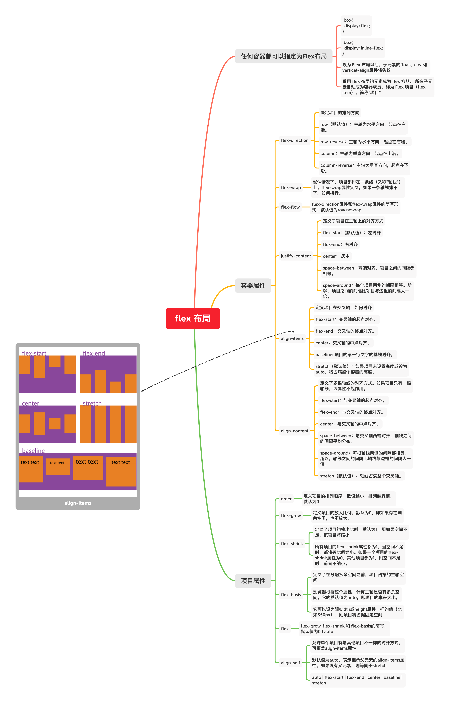

# flex 布局

任何一个容器都可以指定为 Flex 布局

```css
.box{
    display: flex
}    
```

行内元素也可以使用 Flex 布局

```css
.box{
  display: inline-flex;
}
```

设为 Flex 布局以后，子元素的`float`、`clear`和`vertical-align`属性将失效。

Flex 布局是轴线布局，只能指定"项目"针对轴线的位置，可以看作是**一维布局。**Grid 布局则是将容器划分成"行"和"列"，产生单元格，然后指定"项目所在"的单元格，可以看作是**二维布局**。

## 定位

容器默认存在两根轴：水平的主轴（main axis）和垂直的交叉轴（cross axis）




