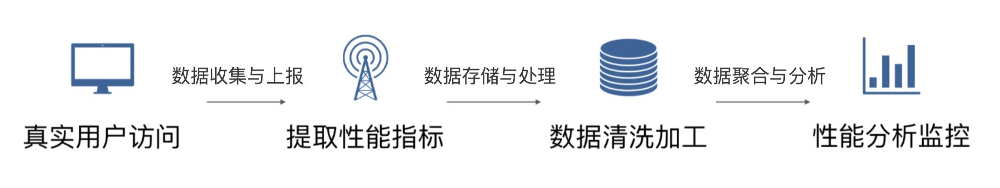

# 上报



性能指标收集注意项：

1. 保证数据的准确性 
2. 尽量不影响应用的性能

## 上报方式

```javascript
window.addEventListener('unload', function () {
    // Collect Run data like before
    let rumData = new FormData()
    rumData.append("entries", JSON.stringify(performance.getEntries())
}, false)
```

