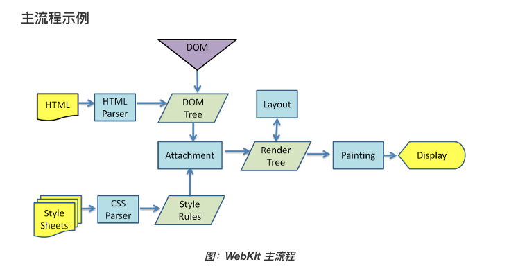

# 上报



性能指标收集注意项：

1. 保证数据的准确性 
2. 尽量不影响应用的性能

## 上报方式

```javascript
window.addEventListener('unload', function () {
    // Collect Run data like before
    let rumData = new FormData()
    rumData.append("entries", JSON.stringify(performance.getEntries())
}, false)
```

## 错误监听

### 利用 window.onerror 监听 js error

window.onerror 函数只有在返回 true 的时候，异常才不会向上抛出，否则即使是知道异常的发生控制台还是会显示 Uncaught Error: xxxxx。

window.onerror 是无法捕获到网络异常的错误。由于网络请求异常不会事件冒泡。

### promise reject 的异常

监听 unhandledrejection 事件

```javascript
window.addEventListener("unhandledrejection", function (event) {
    console.warn("WARNING: Unhandled promise rejection. Shame on you! Reason: "
        + event.reason);
});
```

### iframe 异常

#### 同域

```markup
<iframe src="./iframe.html" frameborder="0"></iframe>
<script>
  window.frames[0].onerror = function (msg, url, row, col, error) {
    console.log('我知道 iframe 的错误了，也知道错误信息');
    console.log({
      msg,  url,  row, col, error
    })
    return true;
  };
</script>
```

#### 非同域

涉及使用 postMessage

### 资源加载失败

window.addEventListener\('error'\)

### 网络请求失败

重写 window.XMLHttpRequest 和 window.fetch 捕获请求错误

### window.console.error


